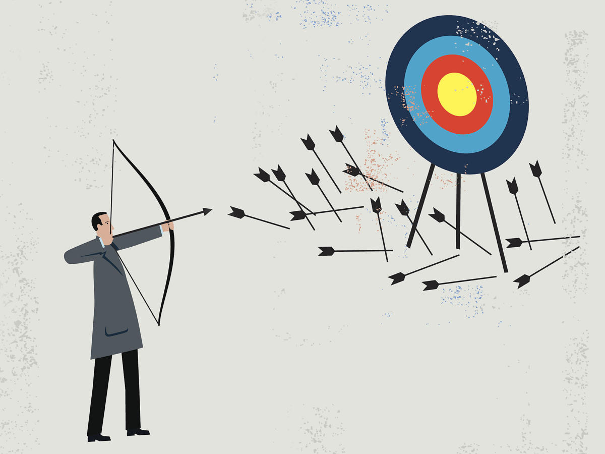

# Failure Resume
> "Failure isn't the opposite of success. It's a part of success" - Arianna Huffington

It is inevitable to see individuals who are just as old as you are but in far more "successful" positions. In moments like those, I like to view their achievements as merely a testament to the number of failures they have overcome. Failure, however, is still very much a taboo topic and despite the motivational quotes (like the one preceding this essay) people tend to keep their failures very close to them. As a consequence, you're often left comparing other's success to your own failures leading to a turmoil of self-deprecating thoughts.

In order to change this, I believe that we should highlight our failures. By doing so, I am hoping to bring light to the fact that we shouldn't have to hide our failures in order to be successful. Now, I know I'm not successful yet but I hope that once I do achieve a level of personal success, others will be able to look at this post and see how much I failed to get there. Therefore, I present to you... my Failure Resume!

## 2020
- Rejected from CS/ECE PhD Programs at: Cornell University, Princeton University
- Rejected from Summer 2020 Internships at: Microsoft Research, Sandia National Lab